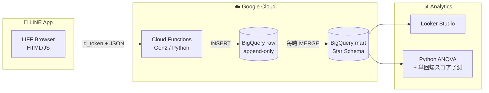

<div align="center">

# 📊 Stats LIFF

**統計検定2級の合格を目指して、自分の学習データ自体をデータパイプラインで扱う個人プロジェクト**

[](.github/workflows/ci.yml)
[](https://www.python.org/)
[](sql/)
[](frontend/)
[](LICENSE)

</div>

---

## 📊 このプロジェクトをひとことで（たとえ話）

**「自分の脳みそを定期健診する血液検査キット」** です。

普通の問題集アプリは「正解 / 不正解」しか測りません。これは血圧計だけ持っているお医者さんと同じで、「健康そう」しか分かりません。

このアプリは「**何秒で解けたか**」も毎回記録します。これは血液検査の **「ばらつき」** に相当します。同じ問題を10回解いて、毎回同じ秒数なら定着している。バラついていたら未定着の疑い。

そして1ヶ月分のデータが溜まると、BigQuery というお医者さんが**診断書（合格確率）**を出してくれます。

---

## 🎯 なぜこんなものを作ったか

統計検定2級は **時間がシビア（90分・35問前後）** で、「解ける」だけでは合格できず「**速く・安定して**解ける」状態が求められます。

そこで、自分自身を被験体に次の仮説を検証することにしました:

> **解答時間の変動係数 (CV = sd/mean) が大きい分野は、たとえ正解率が高くても知識が未定着である**

このアプリは仮説検証のための学習ログ収集基盤であり、同時に**データエンジニアリングの実践プロジェクト**でもあります。

---

## 🏗️ アーキテクチャをたとえ話で



| レイヤ | たとえると | 採用技術 | 役割 |
|---|---|---|---|
| **クライアント** | 🩺 採血器具 | LIFF SDK v2 | スマホで一瞬で解答ログを採取 |
| **API** | 🚚 検体配送業者 | Cloud Functions Gen2 | id_tokenを検証してDBへ届ける |
| **rawデータ層** | 🧊 冷凍庫 | BigQuery raw | 採取した検体を append-only で保存 |
| **martデータ層** | 📋 検査結果ファイル | BigQuery mart (Star Schema) | 分析しやすい形に整理 |
| **分析** | 🔬 病理検査・診断 | Python (ANOVA, 回帰) + Looker | 弱点分野の特定、合格確率の予測 |

---

## 🚀 どうやって動かすか（クイックスタート）

このプロジェクトを再現したい人 / 自分が後日デプロイし直したい時のための手順:

```bash
# 1. 環境変数の準備
cp .env.example .env && $EDITOR .env

# 2. 開発依存のインストール
make setup

# 3. ローカルで lint + test
make check

# 4. デプロイ（BigQuery → Functions → Frontend）
make deploy
```

詳細は [`docs/DEPLOYMENT.md`](docs/DEPLOYMENT.md) を参照。
**WSL2 + Ubuntu 24.04** での実体験ベースで書かれているので、Windows ユーザーでも迷わず進められます。

---

## 📁 ディレクトリの読み方（地図）

```
.
├── frontend/        # 🎨 LIFFクライアント (HTML/CSS/JS) — スマホUIの素材置き場
├── backend/         # 🔧 Cloud Functions (Python) — id_token検証 + 書込み
├── sql/             # 🗂️ BigQuery DDL / シード / ELT / 分析ビュー
├── analysis/        # 📊 ANOVA・単回帰スコア予測スクリプト
├── data/seed/       # 🌱 出題範囲表(34項目)のYAMLマスタ
├── scripts/         # 🛠️ デプロイ・運用スクリプト
├── infra/terraform/ # 🏗️ IaC(将来移行用、現状は雛形)
├── docs/            # 📚 設計判断・制約・ロードマップ
│   ├── adr/         #   設計判断記録 (Architecture Decision Records)
│   └── archive/     #   過去の試行錯誤の保管庫
└── .github/         # 🤖 CI/CD, Issue/PRテンプレ
```

---

## 📊 何が分析できるか

### 1. 期待スコアの推定（合格ライン到達度）

過去問の出題頻度を**重み**として、直近30日の正解率を加重平均で算出。「**現時点で試験を受けたら何点取れるか**」が即座にわかります。

```sql
SELECT ROUND(SUM(accuracy * weight) / SUM(weight) * 100, 1) AS expected_score
FROM `proj.stats_mart.v_topic_perf_30d` WHERE user_id_hash = @uid;
```

### 2. 「正解しているのに不安定」分野の検出

**正解率は合格ラインを超えているが、解答時間のばらつきが大きい**分野は「**運で正解している危険ゾーン**」としてフラグ。

```sql
SELECT major_category, minor_category, accuracy, cv_time
FROM `proj.stats_mart.v_weak_topics`
WHERE unstable_flag = TRUE
ORDER BY cv_time DESC;
```

### 3. 一元配置ANOVAでの分野間比較

「分野間で解答時間に統計的な差があるか」を、**統計検定2級の出題範囲そのもの**を使って検証する。

```bash
python analysis/anova_weak_topics.py --project ${PROJECT_ID} --user-id-hash <hash>
```

### 4. 単回帰での試験日スコア予測

線形モデル（出題範囲の主要項目）を **自分のデータに適用する写経課題** でもあります。

```bash
python analysis/score_projection.py --project ${PROJECT_ID} --user-id-hash <hash> --exam 2026-07-31
```

---

## 🧠 設計判断の記録（ADR）

主要な「なぜそう作ったか」は ADR として残しています。**半年後の自分が読み返すための備忘録**でもあります。

- [ADR-0001](docs/adr/0001-record-architecture-decisions.md) ADRを採用する
- [ADR-0002](docs/adr/0002-bigquery-as-warehouse.md) データウェアハウスにBigQueryを選ぶ
- [ADR-0003](docs/adr/0003-line-id-token-verification.md) LINE id_token をサーバ側で検証する
- [ADR-0004](docs/adr/0004-firebase-hosting-for-liff.md) LIFFのホスティングにFirebase Hostingを選ぶ
- [ADR-0005](docs/adr/0005-star-schema.md) Star Schemaを採用する
- [ADR-0006](docs/adr/0006-migration-from-fastapi-to-cloud-functions.md) **FastAPI/Pandas構成から Cloud Functions/BigQuery構成への移行** ⭐

---

## 📦 過去の試行錯誤（アーカイブ）

このプロジェクトは最初 FastAPI で「**クイズ配信API**」として作り始め、その後「**学習ログ収集パイプライン**」へと方針転換しました。

旧FastAPI実装は捨てずに [`docs/archive/fastapi-experiment/`](docs/archive/fastapi-experiment/) に保管しています。**意思決定の変遷を見せる**ため、そして **再起動リスクへの保険** のためです。

詳細は [ADR-0006](docs/adr/0006-migration-from-fastapi-to-cloud-functions.md) で技術選定の根拠を解説しています。

---

## ⚠️ 既知の制約（誠実な開示）

このプロジェクトは**個人学習用**として最小構成で作られているため、本番運用には複数の課題があります。隠さず開示することで、**「制約を理解している」というスキルそのもの**を示しています。

詳細は [`docs/KNOWN_LIMITATIONS.md`](docs/KNOWN_LIMITATIONS.md):

- **データ完全性**: `time_sec` はクライアント計測のため改ざん可能（自分用なので許容）
- **統計的妥当性**: 解答時間は対数正規に近いため、ANOVAの正規性は満たされない可能性 → Kruskal-Wallisへの切替が望ましい
- **スケーラビリティ**: 単一ユーザー前提。複数ユーザー対応にはハッシュ衝突対策と分離が必要
- **観測性**: Cloud Loggingのみ。SLI/SLO/メトリクスは未整備
- **コスト**: 個人利用では無料枠内だが、BigQueryのフルスキャンはモニタが必要

---

## 🗺️ ロードマップ

詳細は [`docs/ROADMAP.md`](docs/ROADMAP.md):

- **Phase 1（〜2026年7月）**: 合格に直結する最小機能のみで運用
- **Phase 2（合格後）**: dbt導入・Terraform化・Great Expectationsでデータ品質ゲート・Vertex AIでスコア予測モデル
- **Phase 3（発展）**: 他の資格（DB/応用情報等）に汎化できる学習ログSaaSへ

---

## 🔍 後日「あれ、どうやって動かすんだっけ?」となった時のために

半年後の自分のために、**困った時の参照先**を明記しておきます:

| 困りごと | 見るべき場所 |
|---|---|
| デプロイで詰まった | [`docs/DEPLOYMENT.md`](docs/DEPLOYMENT.md) のトラブルシュート |
| 「なぜこの技術を選んだ?」 | [`docs/adr/`](docs/adr/) の該当ADR |
| データ構造を思い出したい | [`docs/DATA_MODEL.md`](docs/DATA_MODEL.md) |
| 全体像を再確認したい | [`docs/ARCHITECTURE.md`](docs/ARCHITECTURE.md) |
| 制約を確認したい | [`docs/KNOWN_LIMITATIONS.md`](docs/KNOWN_LIMITATIONS.md) |
| 次に何やる予定だっけ? | [`docs/ROADMAP.md`](docs/ROADMAP.md) |
| 環境変数の意味 | [`.env.example`](.env.example) のコメント |
| 旧実装どこ? | [`docs/archive/`](docs/archive/) |

---

## 🤝 コントリビューション

個人プロジェクトですが、改善案やバグ報告は歓迎します。詳細は [`CONTRIBUTING.md`](CONTRIBUTING.md) を参照。

セキュリティ上の問題を見つけた場合は [`SECURITY.md`](SECURITY.md) の手順に従ってください。

---

## 📜 ライセンス

[MIT License](LICENSE) — 自己学習・派生利用ともに自由。

---

<div align="center">

**目標: 2026年7月末 / 統計検定2級 合格**

*「動くもの」よりも「目的に合った動くもの」を。*

</div>
