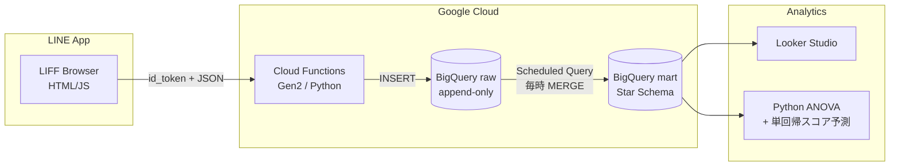

<div align="center">

# 📊 Stats LIFF

**統計検定2級の合格を目指して、自分の学習データ自体をデータパイプラインで扱う個人プロジェクト**

「正解か」だけでなく「何秒かかったか」を記録し、
**解答時間の分散から知識の未定着を統計的に検出する** ことを試みた、データエンジニア視点の自己分析アプリです。

[](.github/workflows/ci.yml)
[](https://www.python.org/)
[](sql/)
[](frontend/)
[](LICENSE)

</div>

---

## 🎯 プロジェクトの動機

統計検定2級は **時間がシビア（90分・35問前後）** で、「解ける」だけでは合格できず「**速く・安定して**解ける」状態が求められます。

そこで、自分自身を被験体に次の仮説を検証することにしました:

> **解答時間の変動係数 (CV = sd/mean) が大きい分野は、たとえ正解率が高くても知識が未定着である**

このアプリは仮説検証のための学習ログ収集基盤であり、同時に**データエンジニアリングの実践プロジェクト**でもあります。

---

## 🏗️ アーキテクチャ



| レイヤ | 採用技術 | 主な判断理由 |
|---|---|---|
| **クライアント** | LIFF SDK v2, Vanilla JS | 専用アプリ不要、LINE上で完結 ([ADR-0004](docs/adr/0004-firebase-hosting-for-liff.md)) |
| **API層** | Cloud Functions Gen2 (Python 3.11) | サーバーレス、id_token検証だけのシンプルな責務 |
| **データレイク** | BigQuery (raw + mart) | 個人利用ならコスト最小、SQL分析が即可能 ([ADR-0002](docs/adr/0002-bigquery-as-warehouse.md)) |
| **モデリング** | Star Schema | 出題範囲表をそのままディメンション化 ([DATA_MODEL.md](docs/DATA_MODEL.md)) |
| **可視化** | Looker Studio | 無料・BigQuery連携が即座 |

---

## 📁 ディレクトリ構成

```
.
├── frontend/        # LIFFクライアント (HTML/CSS/JS)
├── backend/         # Cloud Functions (Python) + テスト
├── sql/             # BigQuery DDL / シード / ELT / 分析ビュー
├── analysis/        # ANOVA・単回帰スコア予測スクリプト
├── data/seed/       # dim_topic等のシードデータ (YAML)
├── scripts/         # デプロイ・運用スクリプト
├── infra/terraform/ # IaC(将来移行用、現状は雛形)
├── docs/            # ARCHITECTURE / DATA_MODEL / ADR / 制約 / ロードマップ
└── .github/         # CI/CD, Issue/PRテンプレ
```

---

## 🚀 クイックスタート

```bash
# 1. 環境変数の準備
cp .env.example .env && $EDITOR .env

# 2. 開発依存のインストール
make setup

# 3. ローカルで lint + test
make check

# 4. デプロイ（BigQuery → Functions → Frontend）
make deploy
```

詳細手順は [`docs/DEPLOYMENT.md`](docs/DEPLOYMENT.md) を参照。

---

## 📊 分析の中身

### 1. 期待スコアの推定（合格ライン到達度）

出題範囲表の**重み（過去問の出題頻度）× 直近30日の正解率**で、現時点での期待スコアを算出。

```sql
SELECT ROUND(SUM(accuracy * weight) / SUM(weight) * 100, 1) AS expected_score
FROM `proj.stats_mart.v_topic_perf_30d` WHERE user_id_hash = @uid;
```

### 2. 「正解しているのに不安定」分野の検出

正解率は合格ラインを超えているが、**解答時間の変動係数（CV）が大きい**分野を「未定着の疑い」としてフラグ。

```sql
SELECT major_category, minor_category, accuracy, cv_time
FROM `proj.stats_mart.v_weak_topics`
WHERE unstable_flag = TRUE
ORDER BY cv_time DESC;
```

### 3. 一元配置ANOVAでの分野間比較

```bash
python analysis/anova_weak_topics.py --project ${PROJECT_ID} --user-id-hash <hash>
```

### 4. 単回帰での試験日スコア予測

「線形モデル」（出題範囲の主要分野）を**自分のデータに適用する写経課題**でもあります。

```bash
python analysis/score_projection.py --project ${PROJECT_ID} --user-id-hash <hash> --exam 2026-07-31
```

---

## 🧠 設計上の意思決定

主要な判断は ADR として残しています:

- [ADR-0001 ADRを採用する](docs/adr/0001-record-architecture-decisions.md)
- [ADR-0002 データウェアハウスにBigQueryを選ぶ](docs/adr/0002-bigquery-as-warehouse.md)
- [ADR-0003 LINE id_token をサーバ側で検証する](docs/adr/0003-line-id-token-verification.md)
- [ADR-0004 LIFFのホスティングにFirebase Hostingを選ぶ](docs/adr/0004-firebase-hosting-for-liff.md)
- [ADR-0005 Star Schemaを採用する](docs/adr/0005-star-schema.md)

---

## ⚠️ 既知の制約と懸念点

このプロジェクトは**個人学習用**として最小構成で作られているため、本番運用には複数の課題があります。詳細と対応案は [`docs/KNOWN_LIMITATIONS.md`](docs/KNOWN_LIMITATIONS.md) に整理しました。

主な要点:

- **データ完全性**: `time_sec` はクライアント計測のため改ざん可能（自分用なので許容）
- **統計的妥当性**: 解答時間は対数正規に近いため、ANOVA前提の正規性は満たされない可能性 → Kruskal-Wallisへの切替が望ましい
- **スケーラビリティ**: 単一ユーザー前提。複数ユーザー対応にはハッシュ衝突対策と分離が必要
- **観測性**: Cloud Loggingのみ。SLI/SLO/メトリクスは未整備
- **コスト**: 個人利用では無料枠内だが、BigQueryのフルスキャンはモニタが必要

---

## 🗺️ ロードマップ

詳細は [`docs/ROADMAP.md`](docs/ROADMAP.md):

- **Phase 1（〜2026年7月）**: 合格に直結する最小機能のみで運用
- **Phase 2（合格後）**: dbt導入・Terraform化・Great Expectationsでデータ品質ゲート・Vertex AIでスコア予測モデル
- **Phase 3（発展）**: 他の資格（DB/応用情報等）に汎化できる学習ログSaaSへ

---

## 🤝 コントリビューション

個人プロジェクトですが、改善案やバグ報告は歓迎します。詳細は [`CONTRIBUTING.md`](CONTRIBUTING.md) を参照。

セキュリティ上の問題を見つけた場合は [`SECURITY.md`](SECURITY.md) の手順に従ってください。

---

## 📜 ライセンス

[MIT License](LICENSE) — 自己学習・派生利用ともに自由。

---

<div align="center">

**目標: 2026年7月末 / 統計検定2級 合格**

</div>
