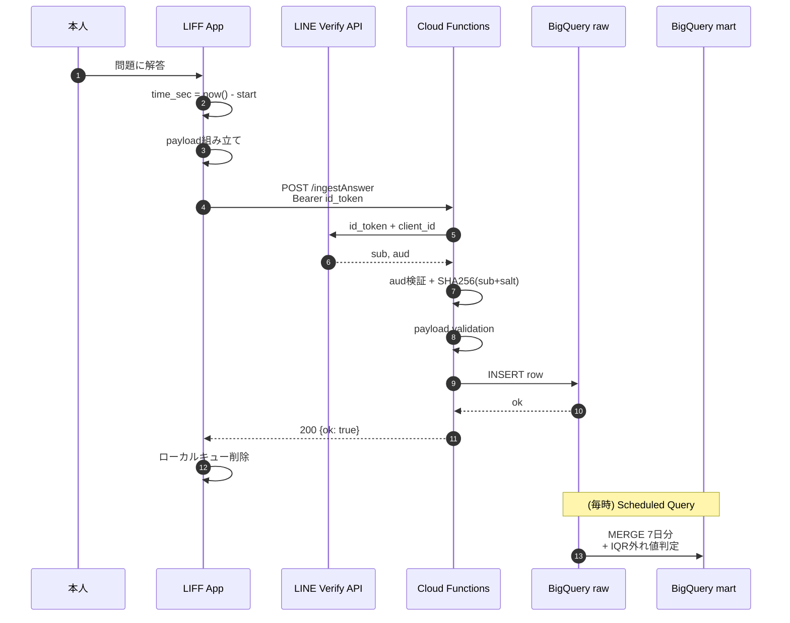

# アーキテクチャ

## 全体像

```mermaid
flowchart TB
  subgraph U[ユーザー (本人)]
    Phone[スマホ LINEアプリ]
  end

  subgraph FE[フロントエンド層]
    LIFF[LIFF App<br/>Firebase Hosting]
  end

  subgraph API[API層]
    CFa[Cloud Functions<br/>ingestAnswer]
    CFb[Cloud Functions<br/>ingestShakyo]
    Verify[LINE Verify API<br/>oauth2/v2.1/verify]
  end

  subgraph DATA[データ層]
    Raw[(BigQuery<br/>stats_raw)]
    Mart[(BigQuery<br/>stats_mart)]
    SQ[Scheduled Query<br/>毎時 MERGE]
  end

  subgraph BI[分析層]
    LS[Looker Studio]
    PY[Python<br/>scipy/pandas]
  end

  Phone --> LIFF
  LIFF -- POST + Bearer --> CFa
  LIFF -- POST + Bearer --> CFb
  CFa -.verify.-> Verify
  CFb -.verify.-> Verify
  CFa -- INSERT --> Raw
  CFb -- INSERT --> Raw
  Raw --> SQ
  SQ --> Mart
  Mart --> LS
  Mart --> PY
```

## レイヤごとの責務

### フロントエンド (LIFF)

- **ファイル**: `frontend/`
- **責務**:
  - LIFF SDK初期化、`getIDToken()` の取得
  - 解答ログ・写経ログの入力UI
  - 解答時間の計測 (`performance.now()`)
  - オフライン時のローカルキューイング
  - LINE内/外ブラウザの環境分岐
- **責務外**:
  - データ集計（すべてサーバ側で実施）
  - 認証（id_token取得まで）

### API層 (Cloud Functions)

- **ファイル**: `backend/main.py`
- **責務**:
  - `Authorization: Bearer` の id_token を **LINE Verify API** で検証
  - `audience` (Channel ID) の一致確認
  - `sub` (LINE userId) の **SHA256 + Salt** ハッシュ化
  - ペイロードのバリデーション（型・範囲・必須項目）
  - BigQuery raw 層への `insert_rows_json`
- **責務外**:
  - データ変換・集計（ETL層に委譲）
  - 認証スキーム自体の実装（LINEに委譲）

### データ層 (BigQuery)

- **ファイル**: `sql/`
- **構成**:
  - `stats_raw`: APIからのappend-only書き込み先
  - `stats_mart`: Star Schemaに整形された分析mart
  - 毎時 Scheduled Query が `MERGE` でidempotentにETL

### 分析層

- **ファイル**: `analysis/`, Looker Studio
- **責務**:
  - 期待スコア・弱点分野の定常監視
  - ANOVA・回帰によるアドホック分析

---

## データフロー (1リクエスト)



---

## 失敗ケースの設計

### ① 通信失敗（移動中など）

1. `fetch` が `AbortError` または non-2xx
2. クライアントは payload を `localStorage` のキューへ
3. ユーザーへは「端末に保存しました」と通知
4. `online` イベント発火時に自動で再送

### ② id_token の改ざん・期限切れ

1. Verify API が `audience mismatch` または `expired`
2. Functions は **401** を返す
3. クライアントは `liff.getIDToken()` を再取得して1回リトライ（実装はPhase 2予定）

### ③ BigQuery書き込み失敗

1. `insert_rows_json` が errors を返す
2. **500** をクライアントへ
3. Cloud Logging に詳細ログ
4. クライアントは①と同じくローカルキューへ

### ④ 重複送信

- `answer_id` (UUID) を主キーとし、ETLの `MERGE` で吸収
- raw 層に2件入っても mart 層では1件に

---

## なぜこの構成か（短縮版）

詳細は `docs/adr/` のADRを参照。要点:

- **LIFF**: 本人がLINEを使うため、追加アプリ不要で導入摩擦最小
- **Cloud Functions Gen2**: 個人利用ならコールドスタートも許容範囲、無料枠が広い
- **BigQuery**: 学習ログは時系列・分野横断クエリが多く、列指向 + パーティションが最適
- **Star Schema**: 出題範囲表（大項目・小項目）がそのままディメンション化できる
- **Scheduled Query**: dbtは個人利用ならオーバーキル、最初は素朴な MERGE で十分

---

## トレードオフ

このアーキテクチャが**得意なこと**:

- 個人の学習データを長期蓄積し、SQL一発で分析
- 移動中・電車内などの不安定な通信環境でデータロスゼロ
- 出題範囲の変更にスキーマがほぼ追随できる

このアーキテクチャが**苦手なこと**:

- リアルタイム集計（BigQueryは数秒〜数十秒のレイテンシ）
- 大量同時アクセス（個人前提の `--allow-unauthenticated`）
- 複数ユーザー間の比較（Phase 3で対応予定）
