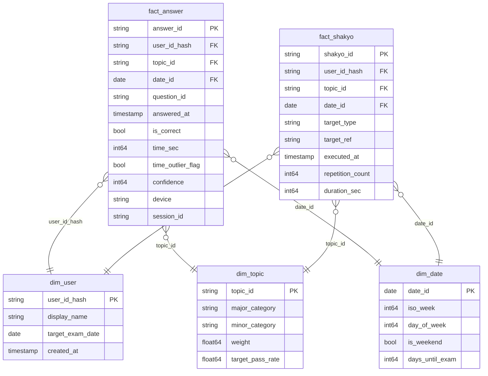

# データモデル

## Star Schema 全体図

## ファクトとディメンションの分離方針

| 種別 | 名称 | 粒度 | 不変性 |
|---|---|---|---|
| Fact | `fact_answer`  | 1解答 = 1行 | append + idempotent merge |
| Fact | `fact_shakyo`  | 1写経実施 = 1行 | append + idempotent merge |
| Dim  | `dim_topic`    | 出題範囲の分野 | SCD Type-1（上書き） |
| Dim  | `dim_user`     | ユーザー1人 | SCD Type-1 |
| Dim  | `dim_date`     | 日付 | 完全静的 |

### 採用しなかった選択肢

- **One Big Table (OBT)**: クエリは速いがディメンション変更（weight調整等）の際に全行更新になる
- **Snowflake Schema**: 出題範囲の階層は2段（大項目・小項目）と浅く、正規化のメリットが小さい
- **Slowly Changing Dimension Type 2**: 個人利用ではweight変更履歴を時系列で追う需要が薄い

## パーティション・クラスタリング戦略

| テーブル | パーティション | クラスタ |
|---|---|---|
| `stats_raw.answer_log`     | `DATE(answered_at)` | `user_id_hash, topic_id` |
| `stats_raw.shakyo_log`     | `DATE(executed_at)` | `user_id_hash, topic_id` |
| `stats_mart.fact_answer`   | `date_id`           | `user_id_hash, topic_id` |
| `stats_mart.fact_shakyo`   | `date_id`           | `user_id_hash, topic_id` |

- **パーティション**: 直近N日のクエリが多いため日付分割が最適
- **クラスタリング**: 「分野別パフォーマンス」が主要クエリのため `topic_id` を含める

## `dim_topic.weight` の決め方

現状は出題範囲表PDFの ●（主出題）/ 〇（関連出題）を 1.0 / 0.5 の単純重みで投入。

Phase 2 では過去問の小問単位で配点を集計し、`data/seed/topics.yaml` に外出しして再計算予定。

## NULL 許容ポリシー

| カラム | NULL許容 | 理由 |
|---|---|---|
| `confidence`     | ✓ | クイック入力時は省略可 |
| `device`         | ✓ | 古いログとの互換性 |
| `session_id`     | ✓ | 連続学習でない場合あり |
| `duration_sec`   | ✓ | 写経の時間計測は任意 |
| その他           | ✗ | NOT NULL |

## 派生ビューの責務

| ビュー | 責務 |
|---|---|
| `v_topic_perf_30d` | 直近30日の分野別 KPI 集計 |
| `v_expected_score` | 期待スコアと合格ライン到達度 |
| `v_weak_topics`    | 不安定フラグ付き弱点ランキング |
| `v_weekly_score`   | 週次トレンド（線形回帰の入力） |

すべて **mart の集計のみで完結** し、生データへの参照はETL層のみが行う。

## 命名規約

- ファクト: `fact_*`、ディメンション: `dim_*`、ビュー: `v_*`
- 主キー: `<table_singular>_id`
- 外部キーは参照先と同名（接頭辞なし）
- タイムスタンプ: `_at` 接尾辞、日付: `_date` または `date_id`

## 参考: 採用しなかったが将来考慮するモデリング

- **Surrogate keys (sk_*)**: BigQueryではUUIDで十分機能するため不採用
- **Audit columns (created_by等)**: 個人利用では不要、Phase 3で再検討
- **Slowly Changing Dimension Type 4 (履歴テーブル分離)**: 過去のweight変更を分析する需要が出たら導入
